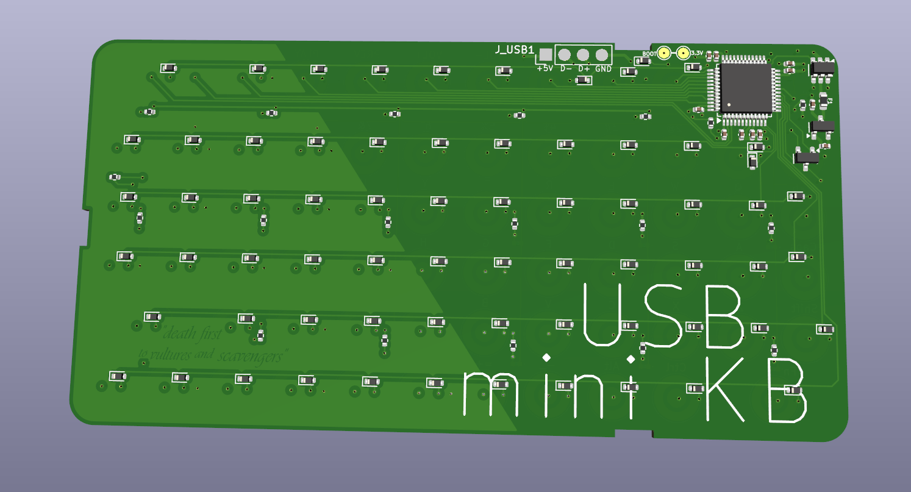

# Rii 518BT USB Conversion PCB

This repository contains everything needed to build a replacement PCB for the [Rii 518BT keyboard](http://www.riitek.com/product/259.html), converting it from Bluetooth-only to USB with QMK firmware support.

## Features

- USB connectivity via STM32F072 microcontroller  
- 6-row × 12-column key matrix  
- Per-switch anti-ghosting diodes  
- Runs [QMK Firmware](https://qmk.fm)  
- Backlight support with 7 brightness levels (Fn+Light)  
- Four user-controllable LEDs (Caps Lock enabled by default)  
- Drop-in replacement for the original PCB

## Repository Contents

- **KiCad source files** for the PCB design  
- **Gerber files** for fabrication  
- **Bill of Materials (BOM)** populated with JLCPCB part numbers  
- **Placement file** for pick-and-place assembly  
- **Firmware file** for flashing the STM32F with QMK

## QMK Firmware

The source for the firmware is located at [https://github.com/tim-eastwood/QMK-rii-518bt-usb](https://github.com/tim-eastwood/QMK-rii-518bt-usb/blob/master/keyboards/rii/518bt/readme.md) `./keyboards/rii`. View the README at that link for flashing / compiling instructions.

## Bootloader Instructions

### First Flash

1. On the back of the keyboard PCB, locate the pads labeled `BOOT` and `3.3V`.
2. Short these pads together **while plugging in** the keyboard via USB.
3. The keyboard will enter **STM32 DFU mode** and appear as such to your system.

### Subsequent Flashes

Once the board has been flashed at least once:

- **Hold the Fn key while plugging in** the keyboard to enter bootloader mode.

## Installation Instructions

1. Separate the top and bottom halves of the Rii 518BT housing (they clip together). You can leave out or glue in place the power switch and connect button plastics if you like - they aren't needed. Either could be used as a handy exit point for the USB cable from the casing.
2. Remove the original PCB (held in by 3 plastic clips).
3. Solder a USB2.0 cable to the pads on the upper reverse side of the PCB. I suggest a dab of hot glue to secure it inside the casing to prevent cable strain. If repurposing an existing cable, the usual pinout is:
   - red: +5v
   - white: D-
   - green: D+
   - black: GND
3. Peel the dome switch sheet off the original PCB.
4. Stick the sheet onto the new PCB, **aligning the domes carefully over the contact pads**.
   - _Optional_: Trim the corner of the sheet covering the LED area (caps lock, etc.) for improved visibility and to reduce light bleed.
5. Clip the new PCB into place and reassemble the case.

## LEDs

- **Caps Lock** LED is functional via pin `B1` (enabled in the provided QMK config).
- **Other LEDs** (Battery, Link, Activity) are routed to:
  - Battery: `B2`
  - Activity: `B10`
  - Link: `B11`
- Modify the QMK firmware to use these as needed if you wish.
- **Backlight** LEDs (white only, non-addressable) are controlled via pin `B0`. Provided firmware offers 7 levels of brightness.

### Backlight Control

Press **Light** to toggle on/off, **Fn + Light** to cycle through brightness levels.

---

Feel free to open an issue or PR if you find bugs or have improvements to suggest!
